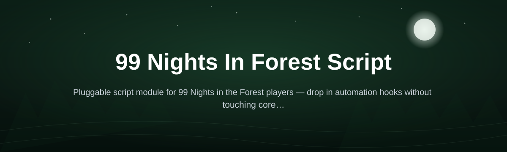
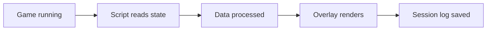

# 99n-forest-script

*A companion utility for players who want clearer information and quality-of-life automation while running through 99 Nights in the Forest.*

## What this is

99n-forest-script is a standalone Windows utility built around one game: 99 Nights in the Forest. It started as a personal tool for tracking night cycles and resource spawns because the base UI doesn't surface much of that information on its own — squinting at the sky to guess how much time was left before the next wave got old fast. Over time it grew into a small overlay-and-automation toolkit that reads what's happening in a run and gives you faster, clearer feedback so you can react instead of guess.

This isn't a mod and it doesn't touch the game's files. It runs alongside the game as a separate window, watching for the situations players ask about most in guides and forums — night countdowns, low-health warnings, nearby threats — and turning them into something you can actually see at a glance. If you've ever wanted a heads-up before a horde spawns instead of after, that's the gap this fills.

  

The button above opens the project's landing page, where you can download the current build.

## Who it is for

- **Solo survivors** who want more warning before night-cycle threats spike.
- **Co-op groups** coordinating resource runs and wanting shared visibility on timers.
- **New players** still learning night patterns and enemy spawn behavior.
- **Long-run players** tracking multi-night progress without alt-tabbing to notes.
- **Streamers** who want a clean on-screen overlay for viewers to follow along.

## What you can do

- **Track the night timer** with a live countdown overlay instead of eyeballing the sky.
- **Get early warnings** before known danger windows in the night cycle.
- **Monitor player vitals** (health/stamina trends) in a compact side panel.
- **Log resource spawns** you've encountered, sorted by location and night number.
- **Set custom alerts** for specific in-run conditions you care about.
- **Auto-organize notes** from a run into a simple session summary.
- **Adjust overlay position and opacity** so it never blocks gameplay.
- **Save per-profile settings** if multiple people use the same PC.

## Getting started

1. Open the landing page using the download button above.
2. Download the latest Windows build listed there.
3. Extract the folder anywhere you have write access (e.g. Desktop).
4. Launch the `.exe` before or after starting 99 Nights in the Forest.
5. Position the overlay once — it remembers your layout on next launch.

## Requirements

- Windows 10 or Windows 11 (64-bit)
- No separate installer, runtime, or toolchain needed — it runs standalone
- 99 Nights in the Forest installed and running for the overlay to have anything to read
- Roughly 150 MB free disk space

## How it works

1. The script launches as its own process, separate from the game.
2. It watches for readable game-state signals (time-of-day, UI elements) without modifying game files.
3. Those signals are converted into overlay data — timers, alerts, panels.
4. The overlay renders on top of your game window at the position you chose.
5. Session notes are saved locally so you can review past runs later.

## FAQ

**Is 99n-forest-script safe to run alongside 99 Nights in the Forest?**
Yes. It runs as a separate overlay process and does not modify or inject into game files.

**Does this work if I'm playing in co-op?**
Yes, the overlay works the same in solo and co-op sessions since it only reads local game state.

**Why doesn't the night timer update?**
Make sure the game window is in focus at least once after launch so the script can detect it — see Troubleshooting below.

**Can I use this on Mac or Linux?**
Not currently. The build targets Windows 10/11 only.

**Will this get my account flagged?**
It doesn't alter game files or memory-write anything into the game process, but always use third-party tools at your own discretion.

## Troubleshooting

- **Overlay doesn't appear:** Run the `.exe` as administrator once, then relaunch normally.
- **Timer seems out of sync:** Restart the script after the game has fully loaded into a run, not before.
- **Settings don't save between sessions:** Check that the extracted folder isn't in a read-only location like Program Files.
- **Window flickers or lags:** Lower the overlay's refresh rate in settings if you're running on integrated graphics.

## License

Released under the [MIT License](LICENSE). This project is an independent fan-made utility and is not affiliated with or endorsed by the developers of 99 Nights in the Forest. Use it at your own discretion.

  

